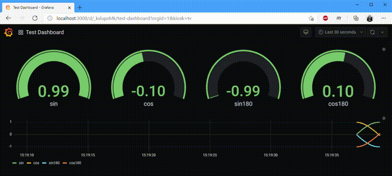

# Grafana hse Streaming Source

This is a simple streaming datasource for Grafana using WebSockets. It is adaptive: The first packet (as JSON) received via WebSocket will set the structure of the metrcis sent to Grafana. 




# Installation in an existing Grafana instance
Download latest release on (url is coming soon) and copy the folder to your plugin folder (e.g. `/var/lib/grafana/plugins/`)

# Demo & Compile
Linux, MacOS, Windows, doesn't matter as long as you have docker and docker-compose installed. To build and run simply do the following:
```BASH
git clone https://github.com/hse-electronics/hse-streaming-source.git
cd hse-streaming-source
docker-compose up
```
Warning: The first build will take some minutes as it has to download and install the grafana developing runtime and initalize the grafana db on the first run. But after that the compile process will be quite fast.

This will build the plugin itself, put it in a Grafana Container which has some provisoning and it will run and build an example server written in C#. When everything is complete just go to your favourite browser and type:
```
http://localhost:3000
```
Login with default user `admin` and password `admin` and voilá, you should see the working example.

# Android Server
A much cooler example is the Android App which uses the Orientation Sensor. It's build with the experimental Blazor Mobile Binding. The pre built apk can be found on the bottom of this page. 

To use the app simply install the apk, turn on your WiFi, run the app and click on `START` You should see an IP-Address and a port. Choose the IP Address of your WiFi (e.g. 192.168.0.100) and enter this on top of the Grafana Dashboard in server like this:
`ws://192.168.0.100:8181` (Change the IP)

# Download builds (coming soon...)
* Pre-Built hse Streaming Source Grafana Plugin
* Pre-Built Android App which uses the OrientationSensor
